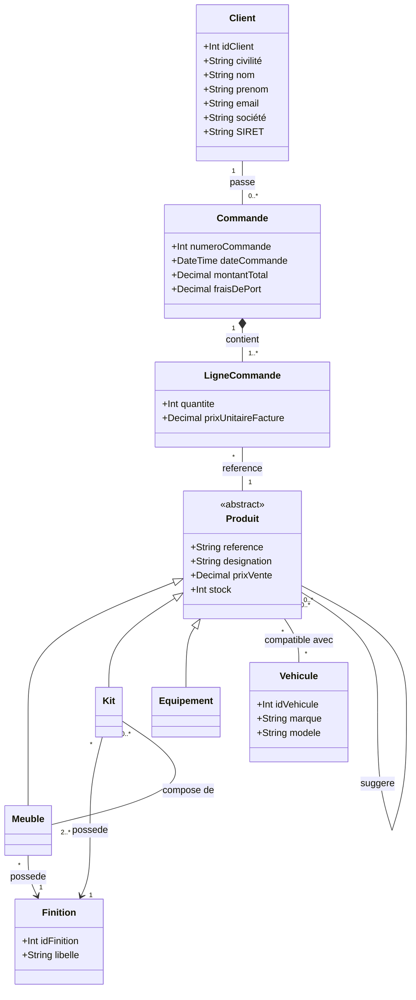
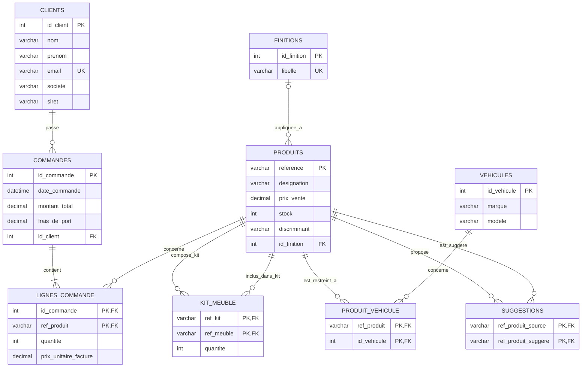

# Exercice : Gestion de Produits, Kits et Compatibilité Véhicules (Héritage)

## 1. Énoncé & Règles de gestion

Une entreprise spécialisée dans l'aménagement de véhicules commercialise différents types de produits et gère les commandes de ses clients.

### Règles de gestion :
1. **Les Produits & l'Héritage :**
   - L'entreprise vend trois types de produits : des **Meubles**, des **Kits** et des **Équipements**.
   - Tous les produits partagent des caractéristiques communes : une référence unique (code article), une désignation, un prix de vente unitaire et une quantité en stock.
   - Les meubles possèdent des dimensions (hauteur, largeur, profondeur).
   - Les kits disposent d'un lien vers une notice de montage.
   - Les équipements possèdent une catégorie ou des caractéristiques techniques spécifiques.
2. **Composition des Kits :**
   - Un kit est composé de meubles (au minimum 2 meubles pour constituer un kit).
   - Un même meuble peut entrer dans la composition de plusieurs kits différents, éventuellement en plusieurs exemplaires (ex: 1 table et 4 chaises).
3. **Finitions :**
   - Les **meubles** et les **kits** peuvent être proposés en 3 finitions prédéfinies : *vernis*, *brut* ou *gris*.
   - Les équipements n'ont pas de notion de finition.
4. **Compatibilité Véhicules :**
   - Chaque véhicule est caractérisé par une marque et un modèle (et éventuellement une année ou génération).
   - **Certains produits** sont compatibles uniquement avec une liste précise de véhicules.
   - **Les autres produits** sont dits "universels" et compatibles avec tous les véhicules.
5. **Suggestions de produits :**
   - Sur la boutique, un produit peut faire l'objet de suggestions de produits complémentaires (association réflexive : un produit peut recommander d'autres produits).
6. **Commandes Clients :**
   - On enregistre les clients (nom, prénom, adresse email unique).
   - Un client passe des commandes (numéro de commande, date, montant global).
   - Une commande est composée d'une ou plusieurs lignes de commande.
   - Chaque ligne de commande référence un produit, une quantité commandée et le prix unitaire facturé (historisé au moment de l'achat).

---

## 2. Schéma de Classes UML



### Explications des choix de modélisation UML :
- **Classe mère abstraite `Produit` :** Permet de mutualiser la référence, la désignation, le prix catalogue et le stock. Elle permet également aux lignes de commande, aux suggestions et aux compatibilités véhicules de pointer de manière uniforme vers n'importe quel produit (`Meuble`, `Kit` ou `Equipement`).
- **Association `Kit` $\leftrightarrow$ `Meuble` avec classe d'association `CompositionKit` :** La cardinalité `2..*` côté Meuble garantit qu'un kit regroupe au moins deux éléments. L'attribut `quantite` dans `CompositionKit` est indispensable si un kit contient $N$ fois la même référence de meuble.
- **Entité `Finition` :** Reliée uniquement à `Meuble` et `Kit`. Les 3 valeurs (*vernis*, *brut*, *gris*) constituent les instances de cette classe.
- **Compatibilité Véhicule :** Relation plusieurs-à-plusieurs (`*` - `*`).
- **Ligne de commande & Historisation du prix :** L'attribut `prixUnitaireFacture` dans `LigneCommande` évite que la modification ultérieure du prix dans `Produit` ne vienne fausser la facture passée.

---

## 3. Schéma Relationnel (Mermaid ERD) - Stratégie TPH (Table Per Hierarchy)

Dans l'approche **TPH (Table Per Hierarchy / Single Table)**, l'ensemble de la hiérarchie d'héritage (`Produit`, `Meuble`, `Kit`, `Equipement`) est fusionné dans **une seule et unique table** `PRODUITS`.
- Une colonne discriminante (`discriminant`) permet d'identifier la spécialisation concrète de chaque enregistrement (`'MEUBLE'`, `'KIT'` ou `'EQUIPEMENT'`).
- Les attributs et associations spécifiques (comme `id_finition` pour les meubles et kits) deviennent des colonnes acceptant la valeur `NULL` (quand le produit est un équipement).
- L'association `Kit` - `Meuble` (`KIT_MEUBLE`) fait référence deux fois à la table `PRODUITS`.



---

## 4. Modèle Logique de Données (MLD textuel) - TPH

- **CLIENT** (<u>id_client</u>, nom, prenom, email, societe, siret)
  - `email` : contrainte `UNIQUE`
  - `societe`, `siret` : optionnels (si client professionnel)
- **COMMANDE** (<u>id_commande</u>, date_commande, montant_total, frais_de_port, #id_client)
  - `#id_client` : clé étrangère référençant `CLIENT(id_client)` (`NOT NULL`)
- **LIGNE_COMMANDE** (<u>#id_commande, #ref_produit</u>, quantite, prix_unitaire_facture)
  - `#id_commande` : clé étrangère référençant `COMMANDE(id_commande)`
  - `#ref_produit` : clé étrangère référençant `PRODUIT(reference)`
- **PRODUIT** (<u>reference</u>, designation, prix_vente, stock, **type_produit**, #id_finition)
  - `type_produit` : colonne discriminante (`CHECK discriminant IN ('MEUBLE', 'KIT', 'EQUIPEMENT')`)
  - `#id_finition` : clé étrangère référençant `FINITION(id_finition)` (`NULL` si `discriminant = 'EQUIPEMENT'`)
- **FINITION** (<u>id_finition</u>, libelle)
  - `libelle` : contrainte `UNIQUE` ('Vernis', 'Brut', 'Gris')
- **KIT_MEUBLE** (<u>#ref_kit, #ref_meuble</u>, quantite)
  - `#ref_kit` : clé étrangère référençant `PRODUIT(reference)` (cible un produit de type 'KIT')
  - `#ref_meuble` : clé étrangère référençant `PRODUIT(reference)` (cible un produit de type 'MEUBLE')
  - `quantite` : nombre d'exemplaires du meuble dans ce kit
- **VEHICULE** (<u>id_vehicule</u>, marque, modele)
- **PRODUIT_VEHICULE** (<u>#ref_produit, #id_vehicule</u>)
  - `#ref_produit` : clé étrangère référençant `PRODUIT(reference)`
  - `#id_vehicule` : clé étrangère référençant `VEHICULE(id_vehicule)`
- **SUGGESTION** (<u>#ref_produit_source, #ref_produit_suggere</u>)
  - `#ref_produit_source` : clé étrangère référençant `PRODUIT(reference)`
  - `#ref_produit_suggere` : clé étrangère référençant `PRODUIT(reference)`

---

## 5. Guide complet : Les stratégies de mapping de l'héritage (TPH vs TPT)

En modélisation orientée objet ou UML, la relation d'héritage (**« est un »** / spécialisation) est un concept fondamental. En revanche, dans un modèle relationnel (SQL Server / SGBDR), **les tables n'héritent pas les unes des autres**.

Pour traduire une hiérarchie d'héritage en tables relationnelles, trois stratégies de mapping existent (popularisées par Martin Fowler et les ORMs comme Entity Framework ou Hibernate) :
1. **TPH (Table Per Hierarchy)** – Une seule table pour toute la hiérarchie.
2. **TPT (Table Per Type)** – Une table pour la classe mère et une table par classe fille.
3. **TPC (Table Per Concrete Class)** – Une table par classe concrète uniquement (sans table mère).

---

### 5.1. La stratégie TPH (Table Per Hierarchy / Single Table)

#### Principe de fonctionnement :
On regroupe la classe mère (`Produit`) et **toutes** ses spécialisations (`Meuble`, `Kit`, `Equipement`) dans **une seule et unique table** `PRODUITS`.

1. **La colonne discriminante (Discriminator) :**
   - Une colonne obligatoire (généralement nommée `type_produit`, `discriminator` ou `classe`) stocke une chaîne ou un code indiquant le type concret de la ligne : `'MEUBLE'`, `'KIT'` ou `'EQUIPEMENT'`.
   - On pose généralement une contrainte SQL :
     ```sql
     CONSTRAINT CK_Produit_Type CHECK (type_produit IN ('MEUBLE', 'KIT', 'EQUIPEMENT'))
     ```
2. **Les attributs spécifiques deviennent `NULL`ables :**
   - Si les sous-classes ont des attributs propres (ex: `hauteur` pour un meuble ou `id_finition` pour un meuble/kit), ces colonnes sont ajoutées à la table unique mais **doivent accepter la valeur `NULL`**, car un enregistrement de type `'EQUIPEMENT'` ne possédera ni hauteur ni finition.

#### Avantages de TPH :
- ⚡ **Performances maximales en lecture :** Aucune jointure (`JOIN`) n'est requise. Que l'on recherche tous les produits, uniquement les kits ou un produit précis par sa référence, une simple clause `WHERE` suffit.
- 🛠️ **Requêtes SQL simples :** Requêter, paginer, trier ou agréger le catalogue est trivial (`SELECT * FROM PRODUITS WHERE stock > 0`).
- 📈 **Évolution du modèle facilitée :** Ajouter une nouvelle sous-classe (ex: `Accessoire`) ne nécessite aucune création de table, uniquement une nouvelle valeur dans le discriminant.

#### Inconvénients et limites de TPH :
- ⚠️ **Perte des contraintes `NOT NULL` natives :** Si une finition est obligatoire pour un meuble, le SGBD ne peut pas simplement poser `NOT NULL` sur la colonne `id_finition`, car cela bloquerait les équipements. Il faut alors recourir à des contraintes `CHECK` conditionnelles :
  ```sql
  CONSTRAINT CK_Finition_Obligatoire 
  CHECK (type_produit = 'EQUIPEMENT' OR id_finition IS NOT NULL)
  ```
- ⚠️ **Intégrité référentielle affaiblie :** La table de composition `KIT_MEUBLE` pointe vers `PRODUITS(reference)`. Rien dans les clés étrangères SQL standard n'empêche d'insérer par erreur un équipement à la place d'un meuble. Ce contrôle doit être assuré par trigger ou au niveau applicatif.
- 🗄️ **Table clairsemée (Sparse table) :** Si les sous-classes possèdent de nombreuses colonnes spécifiques divergentes, la table stocke beaucoup de valeurs `NULL`.

---

### 5.2. La stratégie TPT (Table Per Type / Joined Table)

#### Principe de fonctionnement :
On crée **une table pour chaque classe** du diagramme UML :
- Une table mère `PRODUITS` contenant la clé primaire (`reference`) et les attributs communs (`designation`, `prix_vente`, `stock`).
- Une table fille par sous-classe : `MEUBLES`, `KITS`, `EQUIPEMENTS`.
- **Clé primaire partagée :** La clé primaire de chaque table fille est **à la fois Clé Primaire (PK) et Clé Étrangère (FK)** pointant vers la table mère :
  ```sql
  CREATE TABLE MEUBLES (
      reference VARCHAR(50) PRIMARY KEY,
      id_finition INT NOT NULL,
      CONSTRAINT FK_Meuble_Produit FOREIGN KEY (reference) REFERENCES PRODUITS(reference),
      CONSTRAINT FK_Meuble_Finition FOREIGN KEY (id_finition) REFERENCES FINITIONS(id_finition)
  );
  ```

#### Avantages de TPT :
- 🛡️ **Normalisation stricte (3NF) :** Aucune colonne `NULL` artificielle. Si un attribut est obligatoire pour un meuble, on lui applique simplement une contrainte `NOT NULL`.
- 🔗 **Intégrité référentielle irréprochable :** La table `KIT_MEUBLE` lie directement la table `KITS` à la table `MEUBLES`. Il est techniquement impossible qu'un produit non-meuble soit référencé comme composant d'un kit.
- 📐 **Schéma modulaire et lisible :** Chaque table a une responsabilité unique et reflète fidèlement la structure des classes.

#### Inconvénients et limites de TPT :
- 🐌 **Pénalité de performance (Jointures multiples) :** Pour afficher un meuble avec toutes ses informations, une jointure est obligatoire (`PRODUITS JOIN MEUBLES`). Pour afficher tout le catalogue sans connaître le type à l'avance, il faut faire un ensemble de `LEFT JOIN` sur toutes les tables filles :
  ```sql
  SELECT p.*, m.id_finition AS meuble_finition, k.notice_url
  FROM PRODUITS p
  LEFT JOIN MEUBLES m ON p.reference = m.reference
  LEFT JOIN KITS k ON p.reference = k.reference
  LEFT JOIN EQUIPEMENTS e ON p.reference = e.reference;
  ```
- ✍️ **Écritures dédoublées :** Créer un produit spécialisé impose deux instructions `INSERT` distinctes au sein d'une même transaction.

---

### 5.3. Tableau comparatif de synthèse

| Critère d'évaluation | TPH (Table Per Hierarchy) *(Choix retenu ici)* | TPT (Table Per Type) |
| :--- | :--- | :--- |
| **Nombre de tables** | **1 table unique** (`PRODUITS`) | **4 tables** (`PRODUITS`, `MEUBLES`, `KITS`, `EQUIPEMENTS`) |
| **Colonne discriminante** | **Obligatoire** (`type_produit`) | Inutile (l'appartenance à la table fille identifie le type) |
| **Colonnes `NULL`** | Nombreuses (tous les attributs spécifiques des sous-classes) | Aucune (uniquement les champs réellement optionnels) |
| **Contraintes `NOT NULL`** | Difficiles à poser sur les spécificités (exige des contraintes `CHECK`) | Simples et natives dans chaque table fille |
| **Vitesse en lecture (SELECT)** | **Excellente** (zéro jointure) | Plus lente (jointures `INNER` ou `LEFT JOIN` systématiques) |
| **Vitesse en écriture (INSERT)** | **1 seul INSERT** | **2 INSERTs** chaînés par transaction |
| **Contrôle d'intégrité des FK** | Moins strict (la FK pointe vers la table mère globale) | Très strict (la FK pointe vers la table fille spécifique) |

---

### 5.4. Quand choisir TPH et quand choisir TPT en entreprise ?

| Situation / Contexte projet | Stratégie recommandée | Justification |
| :--- | :---: | :--- |
| Les sous-classes ont **peu ou pas d'attributs spécifiques** | **TPH** | Créer des tables filles quasi vides pour 0 ou 1 colonne n'apporte que de la complexité inutile. C'est le cas de notre exercice ! |
| Les lectures sont massives et la performance est critique (ex: E-commerce) | **TPH** | Évite les jointures coûteuses sur les requêtes de recherche, filtres et pagination. |
| Les sous-classes ont **beaucoup d'attributs distincts et obligatoires** | **TPT** | Évite d'avoir une table avec des dizaines de colonnes vides à 80% et garantit les règles métier via les contraintes de colonnes. |
| D'autres entités doivent référencer **exclusivement** un sous-type particulier | **TPT** | Permet des clés étrangères strictes garanties nativement par le moteur SQL sans code de contrôle applicatif. |

