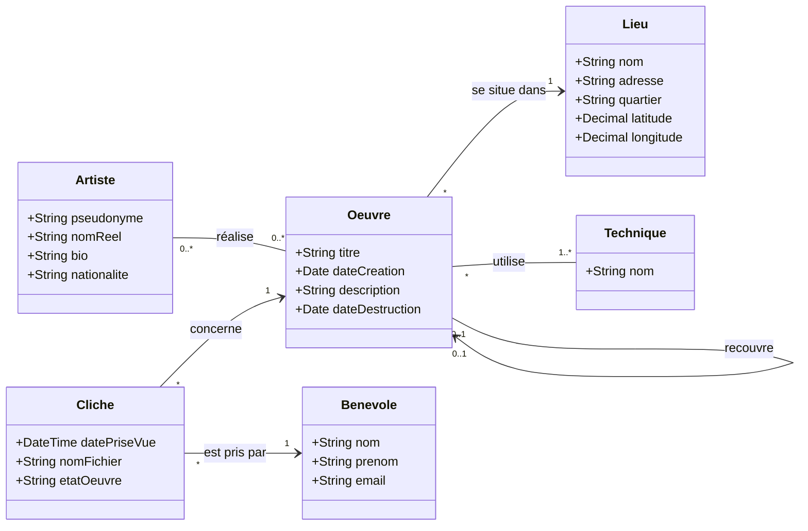

Pour se remettre les idées au clair, on va fait quelques exercices de révision.

## Exercice 1
### Partie 1 : UML
L'association "Art-2-Rue" souhaite développer une application pour archiver le patrimoine éphémère du Street Art. Vous êtes chargé de concevoir et de créer la base de données sous **SQL Server**.

### A gérer :
1.  **Les Artistes :** On doit enregistrer leur pseudonyme (qui est unique), leur nom réel (optionnel), leur bio et leur nationalité (optionnel).
2.  **Les Lieux :** Les œuvres sont situées à des adresses précises. Chaque lieu est défini par un nom, une adresse (pas toujours), un quartier de la ville (ex: "Ste Anne", "Chateau"), et ses coordonnées GPS (Latitude et Longitude).
3.  **Les Œuvres :** Une œuvre possède un titre, une date de création (si connue) et une description. Une œuvre est réalisée par **0 ou plusieurs** artiste et se trouve dans **un seul** lieu. On peut aussi vouloir savoir si une œuvre a été détruite ou recouverte par une autre. 
4.  **Les Techniques :** On souhaite répertorier les techniques utilisées (ex: "Bombe aérosol", "Pochoir", "Collage", "Mosaïque"). Une œuvre peut combiner **plusieurs techniques**.
5.  **Les bénévoles :** Ce sont des photographes qui prennent des clichés des œuvres pour suivre leur évolution. On stocke leur nom, prénom et adresse email.
6.  **Les Clichés :** Une photo représente une œuvre à un instant T. On enregistre la date de prise de vue, le nom du fichier image (ex: "mur_01.jpg") et l'état de l'œuvre au moment de la photo (un petit commentaire facultatif). Un cliché concerne **une seule** œuvre et est pris par **un seul** photographe.

### Schéma de classes UML

#### Explications des choix de modélisation :
- **Artiste - Oeuvre (`0..*` - `0..*`)** : Une œuvre peut être anonyme (`0`) ou collective (`plusieurs`). Un artiste peut avoir réalisé 0 ou plusieurs œuvres répertoriées.
- **Oeuvre - Lieu (`*` -> `1`)** : Une œuvre est obligatoirement et uniquement associée à un seul lieu. Un lieu peut accueillir 0 ou plusieurs œuvres.
- **Oeuvre - Technique (`*` - `1..*`)** : Une œuvre combine une ou plusieurs techniques. Une technique peut être utilisée sur plusieurs œuvres.
- **Cliche - Oeuvre (`*` -> `1`)** : Chaque cliché concerne une et une seule œuvre. Une œuvre peut avoir 0 ou plusieurs clichés pris au fil du temps.
- **Cliche - Bénévole (`*` -> `1`)** : Chaque cliché est pris par un et un seul photographe bénévole.
- **Relation réflexive sur Oeuvre (`0..1` -> `0..1 : recouvre`)** : Permet de tracer si une œuvre en a recouvert une autre à cet endroit. L'attribut `estDetruite` permet quant à lui de savoir si l'œuvre a disparu.

