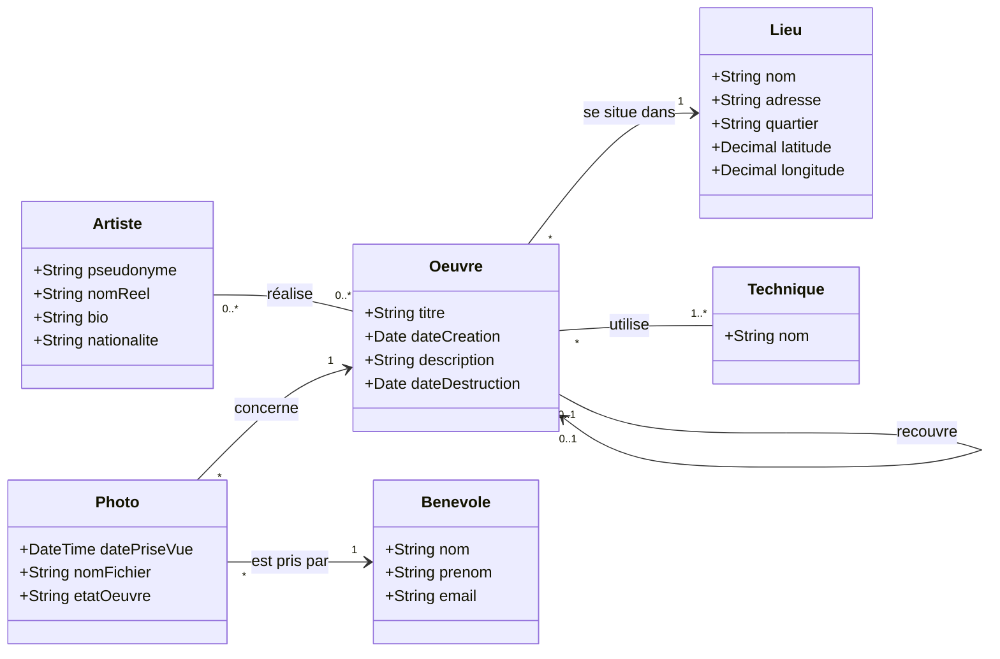
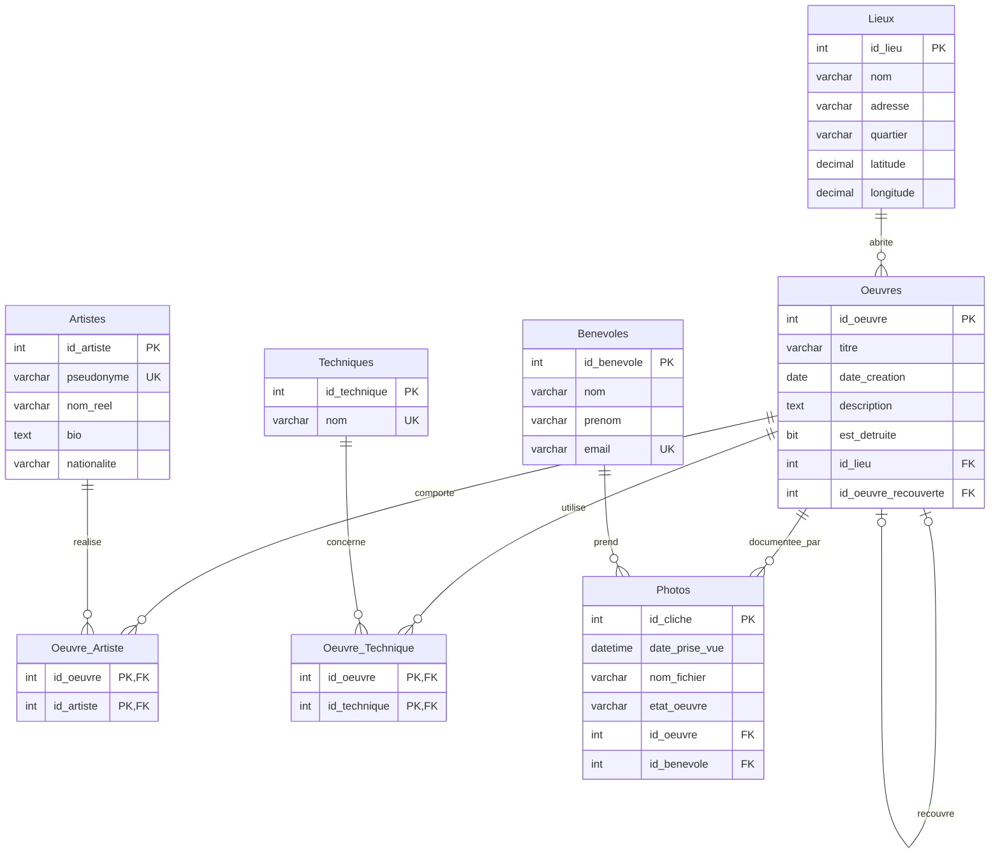
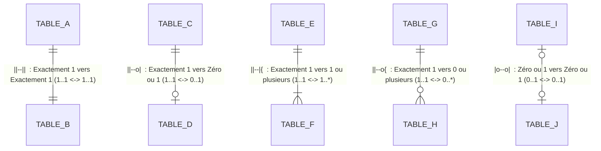

Pour se remettre les idées au clair, on va fait quelques exercices de révision.

## Exercice 1
### Partie 1 : UML
L'association "Art-2-Rue" souhaite développer une application pour archiver le patrimoine éphémère du Street Art. Vous êtes chargé de concevoir et de créer la base de données sous **SQL Server**.

### A gérer :
1.  **Les Artistes :** On doit enregistrer leur pseudonyme (qui est unique), leur nom réel (optionnel), leur bio et leur nationalité (optionnel).
2.  **Les Lieux :** Les œuvres sont situées à des adresses précises. Chaque lieu est défini par un nom, une adresse (pas toujours), un quartier de la ville (ex: "Ste Anne", "Chateau"), et ses coordonnées GPS (Latitude et Longitude).
3.  **Les Œuvres :** Une œuvre possède un titre, une date de création (si connue) et une description. Une œuvre est réalisée par **0 ou plusieurs** artiste et se trouve dans **un seul** lieu. On peut aussi vouloir savoir si une œuvre a été détruite ou recouverte par une autre. 
4.  **Les Techniques :** On souhaite répertorier les techniques utilisées (ex: "Bombe aérosol", "Pochoir", "Collage", "Mosaïque"). Une œuvre peut combiner **plusieurs techniques**.
5.  **Les bénévoles :** Ce sont des photographes qui prennent des clichés des œuvres pour suivre leur évolution. On stocke leur nom, prénom et adresse email.
6.  **Les Photos :** Une photo représente une œuvre à un instant T. On enregistre la date de prise de vue, le nom du fichier image (ex: "mur_01.jpg") et l'état de l'œuvre au moment de la photo (un petit commentaire facultatif). Un cliché concerne **une seule** œuvre et est pris par **un seul** photographe.

### Schéma de classes UML

```mermaid
classDiagram
    direction LR

    class Artiste {
        +String pseudonyme
        +String nomReel
        +String bio
        +String nationalite
    }

    class Lieu {
        +String nom
        +String adresse
        +String quartier
        +Decimal latitude
        +Decimal longitude
    }

    class Oeuvre {
        +String titre
        +Date dateCreation
        +String description
        +Date dateDestruction
    }

    class Technique {
        +String nom
    }

    class Benevole {
        +String nom
        +String prenom
        +String email
    }

    class Photo {
        +DateTime datePriseVue
        +String nomFichier
        +String etatOeuvre
    }

    Artiste "0..*" -- "0..*" Oeuvre : réalise
    Oeuvre "*" --> "1" Lieu : se situe dans
    Oeuvre "*" -- "1..*" Technique : utilise
    Photo "*" --> "1" Oeuvre : concerne
    Photo "*" --> "1" Benevole : est pris par
    Oeuvre "0..1" --> "0..1" Oeuvre : recouvre
```

#### Explications des choix de modélisation :
- **Artiste - Oeuvre (`0..*` - `0..*`)** : Une œuvre peut être anonyme (`0`) ou collective (`plusieurs`). Un artiste peut avoir réalisé 0 ou plusieurs œuvres répertoriées.
- **Oeuvre - Lieu (`*` -> `1`)** : Une œuvre est obligatoirement et uniquement associée à un seul lieu. Un lieu peut accueillir 0 ou plusieurs œuvres.
- **Oeuvre - Technique (`*` - `1..*`)** : Une œuvre combine une ou plusieurs techniques. Une technique peut être utilisée sur plusieurs œuvres.
- **Cliche - Oeuvre (`*` -> `1`)** : Chaque cliché concerne une et une seule œuvre. Une œuvre peut avoir 0 ou plusieurs clichés pris au fil du temps.
- **Cliche - Bénévole (`*` -> `1`)** : Chaque cliché est pris par un et un seul photographe bénévole.
- **Relation réflexive sur Oeuvre (`0..1` -> `0..1 : recouvre`)** : Permet de tracer si une œuvre en a recouvert une autre à cet endroit. L'attribut `estDetruite` permet quant à lui de savoir si l'œuvre a disparu.

---

### Partie 2 : Schéma de base de données relationnelle (ERD / MLD)

#### Schéma relationnel (Mermaid ERD)

```mermaid
erDiagram
    Artistes {
        int id_artiste PK
        varchar pseudonyme UK
        varchar nom_reel
        text bio
        varchar nationalite
    }

    Lieux {
        int id_lieu PK
        varchar nom
        varchar adresse
        varchar quartier
        decimal latitude
        decimal longitude
    }

    Oeuvres {
        int id_oeuvre PK
        varchar titre
        date date_creation
        text description
        bit est_detruite
        int id_lieu FK
        int id_oeuvre_recouverte FK
    }

    Techniques {
        int id_technique PK
        varchar nom UK
    }

    Oeuvre_Artiste {
        int id_oeuvre PK, FK
        int id_artiste PK, FK
    }

    Oeuvre_Technique {
        int id_oeuvre PK, FK
        int id_technique PK, FK
    }

    Benevoles {
        int id_benevole PK
        varchar nom
        varchar prenom
        varchar email UK
    }

    Photos {
        int id_cliche PK
        datetime date_prise_vue
        varchar nom_fichier
        varchar etat_oeuvre
        int id_oeuvre FK
        int id_benevole FK
    }

    Lieux ||--o{ Oeuvres : "abrite"
    Oeuvres ||--o{ Oeuvre_Artiste : "comporte"
    Artistes ||--o{ Oeuvre_Artiste : "realise"
    Oeuvres ||--o{ Oeuvre_Technique : "utilise"
    Techniques ||--o{ Oeuvre_Technique : "concerne"
    Oeuvres ||--o{ Photos : "documentee_par"
    Benevoles ||--o{ Photos : "prend"
    Oeuvres |o--o| Oeuvres : "recouvre"
```

##### Légende de la notation Mermaid ERD ("Patte d'oie" / Crow's Foot)

En Mermaid, les relations s'écrivent : `<EntitéA> <SymboleGauche><TypeLien><SymboleDroit> <EntitéB> : "label"`.

###### Diagramme visuel des notations Mermaid :

```mermaid
erDiagram
    TABLE_A ||--|| TABLE_B : "||--||  : Exactement 1 vers Exactement 1 (1..1 <-> 1..1)"
    TABLE_C ||--o| TABLE_D : "||--o|  : Exactement 1 vers Zéro ou 1 (1..1 <-> 0..1)"
    TABLE_E ||--|{ TABLE_F : "||--|{  : Exactement 1 vers 1 ou plusieurs (1..1 <-> 1..*)"
    TABLE_G ||--o{ TABLE_H : "||--o{  : Exactement 1 vers 0 ou plusieurs (1..1 <-> 0..*)"
    TABLE_I |o--o| TABLE_J : "|o--o|  : Zéro ou 1 vers Zéro ou 1 (0..1 <-> 0..1)"
```

###### Tableau de correspondance des symboles Mermaid :

| Symbole gauche | Symbole droit | Rendu visuel           | Cardinalité (UML / Merise) | Signification                     |
| :------------: | :-----------: | :--------------------- | :------------------------: | :-------------------------------- |
|     `\|\|`     |    `\|\|`     | Deux barres parallèles |       **1..1** (1,1)       | **Exactement un** (obligatoire)   |
|     `\|o`      |     `o\|`     | Cercle + barre         |       **0..1** (0,1)       | **Zéro ou un** (optionnel)        |
|     `}\|`      |     `\|{`     | Patte d'oie + barre    |      **1..\*** (1,n)       | **Un à plusieurs** (au moins un)  |
|      `}o`      |     `o{`      | Patte d'oie + cercle   |      **0..\*** (0,n)       | **Zéro à plusieurs** (quelconque) |

> **Type de trait :**
> - `--` (trait plein) : relation identifiante
> - `..` (trait pointillé) : relation non identifiante

###### Exemples appliqués à notre schéma :
- `LIEU ||--o{ OEUVRE` :
  - `||` côté `LIEU` : une œuvre a **exactement 1** lieu.
  - `o{` côté `OEUVRE` : un lieu abrite de **0 à plusieurs** œuvres.
- `BENEVOLE ||--o{ CLICHE` :
  - `||` côté `BENEVOLE` : un cliché est pris par **exactement 1** bénévole.
  - `o{` côté `CLICHE` : un bénévole peut prendre de **0 à plusieurs** clichés.
- `OEUVRE ||--o{ CLICHE` :
  - `||` côté `OEUVRE` : un cliché concerne **exactement 1** œuvre.
  - `o{` côté `CLICHE` : une œuvre peut avoir de **0 à plusieurs** clichés.
- `OEUVRE |o--o| OEUVRE` (relation réflexive) :
  - `|o` et `o|` : une œuvre peut recouvrir au plus **0 ou 1** œuvre, et être recouverte par au plus **0 ou 1** œuvre.

#### Modèle Logique de Données (MLD textuel)

- **ARTISTE** (<u>id_artiste</u>, pseudonyme, nom_reel, bio, nationalite)
  - `pseudonyme` : contrainte `UNIQUE` (identifiant métier)
- **LIEU** (<u>id_lieu</u>, nom, adresse, quartier, latitude, longitude)
- **OEUVRE** (<u>id_oeuvre</u>, titre, date_creation, description, est_detruite, #id_lieu, #id_oeuvre_recouverte)
  - `#id_lieu` : Clé étrangère référençant `LIEU(id_lieu)` (`NOT NULL`)
  - `#id_oeuvre_recouverte` : Clé étrangère réflexive référençant `OEUVRE(id_oeuvre)` (`NULL`, `UNIQUE`)
- **TECHNIQUE** (<u>id_technique</u>, nom)
  - `nom` : contrainte `UNIQUE`
- **OEUVRE_ARTISTE** (<u>#id_oeuvre, #id_artiste</u>)
  - Clé primaire composite formée des deux clés étrangères
  - `#id_oeuvre` : Clé étrangère référençant `OEUVRE(id_oeuvre)`
  - `#id_artiste` : Clé étrangère référençant `ARTISTE(id_artiste)`
- **OEUVRE_TECHNIQUE** (<u>#id_oeuvre, #id_technique</u>)
  - Clé primaire composite formée des deux clés étrangères
  - `#id_oeuvre` : Clé étrangère référençant `OEUVRE(id_oeuvre)`
  - `#id_technique` : Clé étrangère référençant `TECHNIQUE(id_technique)`
- **BENEVOLE** (<u>id_benevole</u>, nom, prenom, email)
  - `email` : contrainte `UNIQUE`
- **CLICHE** (<u>id_cliche</u>, date_prise_vue, nom_fichier, etat_oeuvre, #id_oeuvre, #id_benevole)
  - `#id_oeuvre` : Clé étrangère référençant `OEUVRE(id_oeuvre)` (`NOT NULL`)
  - `#id_benevole` : Clé étrangère référençant `BENEVOLE(id_benevole)` (`NOT NULL`)

## Requetes SQL

1.  **Annuaire des Lieux :** Afficher l'adresse du lieu, le nom du quartier trié par quartier.
2.  **Fiche Artiste :** Lister le titre de l'œuvre, la date de réalisation et le pseudonyme de l'artiste pour toutes les œuvres créées après le 01/01/2023.
3.  **Bilan des Techniques :** Afficher le nom de chaque technique et le nombre total d'œuvres l'utilisant. On veut aussi voir les techniques qui n'ont encore jamais été utilisées (total = 0).
4.  **Traçabilité :** Afficher le nom et le prénom des photographes ayant pris des photos d'œuvres réalisées par l'artiste "C215" dans le quartier "Centre".